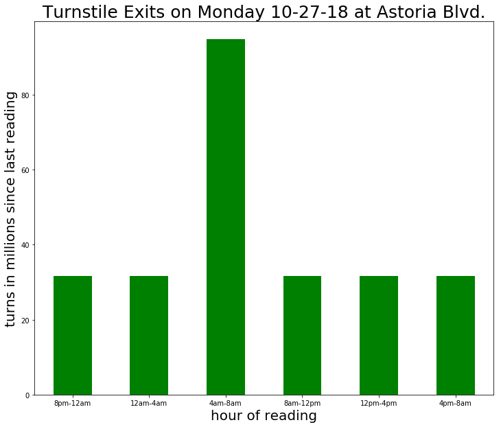

### Assignment 1: 
I worked with Martha Ruth Norrick and Christine Biddlecomb on this assignment. I was confused about how to even begin approaching this assignment. Martha and Christine helped me conceptually with what an array is and how this particular array is structures (3 dimensions! who knew?). Martha also helped me understand what rolling means are and how they work to smooth out noise in a graph. Christine helped me understand which information was on which axis (i.e. 0=stations, 1=card types, 2=weeks). Christine contributed the majority of parts 1 and 2 for this assignment (I made very slight changes in her code to rename variables and play around with the code). Christine very kindly walked me through what each cell of code was doing and why.  

### Assignment 2 was completed independently, based on feedback from my classmate. 

### I've edited this to reflect Cyrus's suggestion to 1) remove legend; 2) rotate x-ticks' 3) include date in title; 4) make the x labels into bins so that it is clear that the measurement is for 4 hours; I also increased font sizes.

