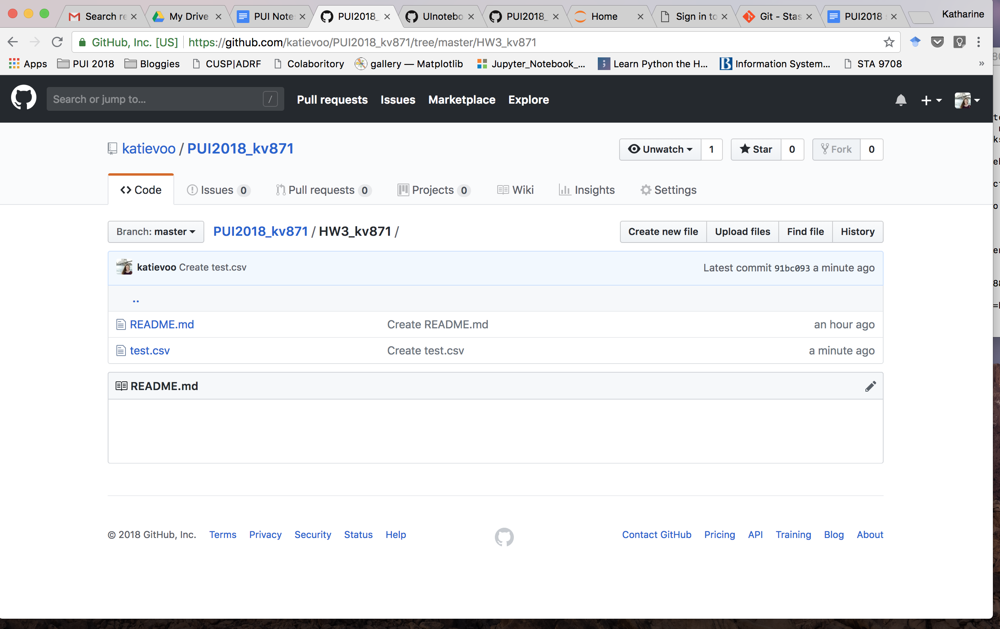

## Homework 3

Here are the screenshots to prove that text.csv existed in this repo at one time. 

## Assignment 3

I got help on this assignment from Christine Bittlecomb, Nathan Caplan, Cyrus Blankinship, and Martha Ruth Norrick. Christine helped me understand the structure of the code and especially the 'sys' arguments. Cyrus helped me navigate through the json file to the information I wanted, and to set up the "for i" loop. Nathan sent me a screenshot of his code so that I could troubleshoot, and I took the 'bus_number' parts of my code from that. Martha helped me understand how to convert an .ipynb file to a .py file and then how to run that in my terminal. 
