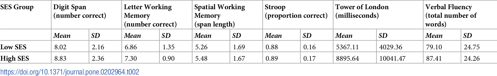

## Assignment 2: Literature choices of statistical tests

| **Statistical Analyses**	|  **IV(s)**  |  **IV type(s)** |  **DV(s)**  |  **DV type(s)**  |  **Control Var** | **Control Var type**  | **Question to be answered** | **_H0_** | **alpha** | **link to paper**| 
|:----------:|:----------|:------------|:-------------|:-------------|:------------|:------------- |:------------------|:----:|:-------:|:-------|
| MANCOVA|  1, high or low family socioeconomic status (SES) at age 8-10  | categorical |  1, executive functioning (EF) as measured by performance on 6 tasks |  1, continuous  |  1, race 2, gender 3,age| 1, categorical 2, categorical 3, continuous | Do effects of childhood socioeconomic status on executive functioning persist into young adulthood? | The relationship btwn childhood SES and EF dimishes with age (unclear how to state this mathematically) | .05 | [Childhood socioeconomic status and executive function in childhood and beyond](https://journals.plos.org/plosone/article?id=10.1371/journal.pone.0202964#sec004)| 
 | Multiple Regression|  **IV(s)**  |  **IV type(s)** |  **DV(s)**  |  **DV type(s)**  |  **Control Var** | **Control Var type**  | **Question to be answered** | **_H0_** | **alpha** | [The Efficacy of Exercise in Reducing Depressive Symptoms among Cancer Survivors: A Meta-Analysis](https://journals.plos.org/plosone/article?id=10.1371/journal.pone.0030955#s2)| 
 | Logistic Regression |  **IV(s)**  |  **IV type(s)** |  **DV(s)**  |  **DV type(s)**  |  **Control Var** | **Control Var type**  | **Question to be answered** | **_H0_** | **alpha** | [Your Relevance Feedback Is Essential: Enhancing the Learning to Rank Using the Virtual Feature Based Logistic Regression](https://journals.plos.org/plosone/article?id=10.1371/journal.pone.0050112#s2)| 
 
 |||||||||
  
  
  Child SES and EF image: 
  
 
 
 