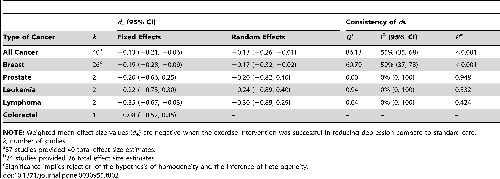
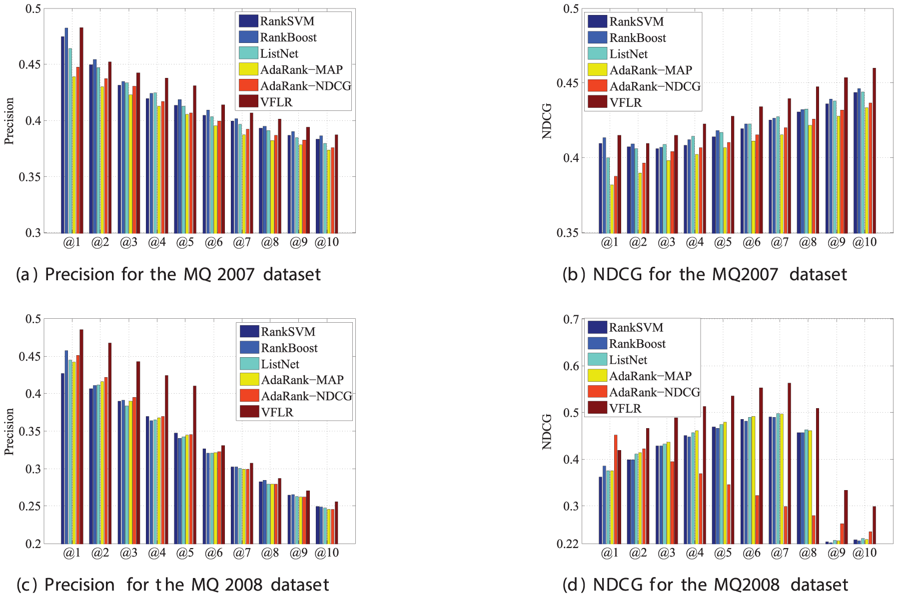

## Assignment 2: Literature choices of statistical tests

| **Statistical Analyses**	|  **IV(s)**  |  **IV type(s)** |  **DV(s)**  |  **DV type(s)**  |  **Control Var** | **Control Var type**  | **Question to be answered** | **_H0_** | **alpha** | **link to paper**| 
|:----------:|:----------|:------------|:-------------|:-------------|:------------|:------------- |:------------------|:----:|:-------:|:-------|
| MANCOVA|  1, high or low family socioeconomic status (SES) at age 8-10  | categorical |  1, executive functioning (EF) as measured by performance on 6 tasks |  1, continuous  |  1, race 2, gender 3,age| 1, categorical 2, categorical 3, continuous | Do effects of childhood socioeconomic status on executive functioning persist into young adulthood? | The relationship btwn childhood SES and EF dimishes with age (unclear how to state this mathematically) | .05 | [Childhood socioeconomic status and executive function in childhood and beyond](https://journals.plos.org/plosone/article?id=10.1371/journal.pone.0202964#sec004)| 
 | Multiple Regression|  1, exercise (intensity in metabolic equivalent units (METs), weekly volume in minutes per week and frequency per week)  |  1, continuous |  1, effect size 'd' on depressive symptoms (normalized to scale from 0-100)|  1, continious  |  1, type of cancer 2, age | 1, categorical 2, continuous | Does exercise reduce depressive symptoms among cancer survivors? | 'd' (depressive symptoms at beginning of trial - depressive symptoms at end of trial) of exercise group  <= 'd' symptoms in control groups| .05| [The Efficacy of Exercise in Reducing Depressive Symptoms among Cancer Survivors: A Meta-Analysis](https://journals.plos.org/plosone/article?id=10.1371/journal.pone.0030955#s2)| 
 | Logistic Regression | 1, ranking method  |  1, categorical |  1, precision (as measured by Mean Average Precision (MAP), Precision at position k (P@k), and Normalized Discounted Cumulative Gain at position k (NDCG@k))  |  1, continuous |  **Control Var** | **Control Var type**  | Does the Virtual Feature based Logistic Regression (VFLR) ranking method (taking into account user feedback) improve precision for information retrieval applications? | precision of VFLR <= precision of existing models | **alpha** | [Your Relevance Feedback Is Essential: Enhancing the Learning to Rank Using the Virtual Feature Based Logistic Regression](https://journals.plos.org/plosone/article?id=10.1371/journal.pone.0050112#s2)| 
 
 |||||||||
  
  
  Child SES and EF image: 
  
 
 
  Exercise and depressive symptoms in Cancer Survivors
  
   

"The effect size d denotes the difference between the mean depression values of the control and exercise groups, divided by the pooled standard deviation; the sign of d values was set to be negative when the exercise group reduced depression more than the control group. "

VFLR ranking precision: 

