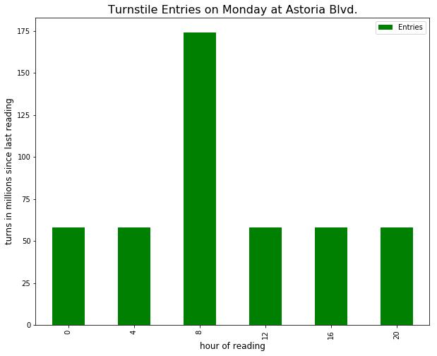

## Visualization of Turnstile Entries at Astoria Blvd. N Station 

**Katie's comments**: *The MTA collects data on subway ridership by measuring the number of turns (entering and exiting) on each turnstile. Every four hours, each turnstile reports the number of entries and exits recorded over the previous 4 hours. The figure above shows the entry figures for one station, Astoria Blvd. on a Monday (Oct. 29th), in millions of turns. The figure suggests that further exploration of and cleaning of the data is necessary. While it makes intuitive sense that there are more riders entering the subway during the morning hours, the large number for the 8 am reading might indicate that there was more than one reading during that hour.*

**Cyrus' review**: The plot itself is easy to comprehend, well labelled, and units are clarified for each axis (turns in millions/hours). Here are a few minor edits that would clean it up a bit more
* Rotate the hour 'ticks' so that they read horizontally.
* Bin the data so you can tell each 'hour' is really the 4 hours before it
    * i.e. 8 --> 4-8
* Eliminate the legend for entries since this is clear from the title and it is the only element on the graph
* Clarify the title: Is this all Monday's for a given year? All Monday's for all the data you have? Or is it a specific Monday?

As far as the analysis goes, I agree that further exploration/data cleaning is required. It seems odd that there is not a similar peak in the 16-20 hour timeframe since that is the time of evening commute. Or is this only counting the entries and excluding all exits? I suppose exits out of the emergency doors aren't counted.
